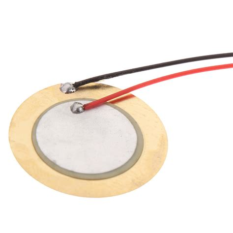
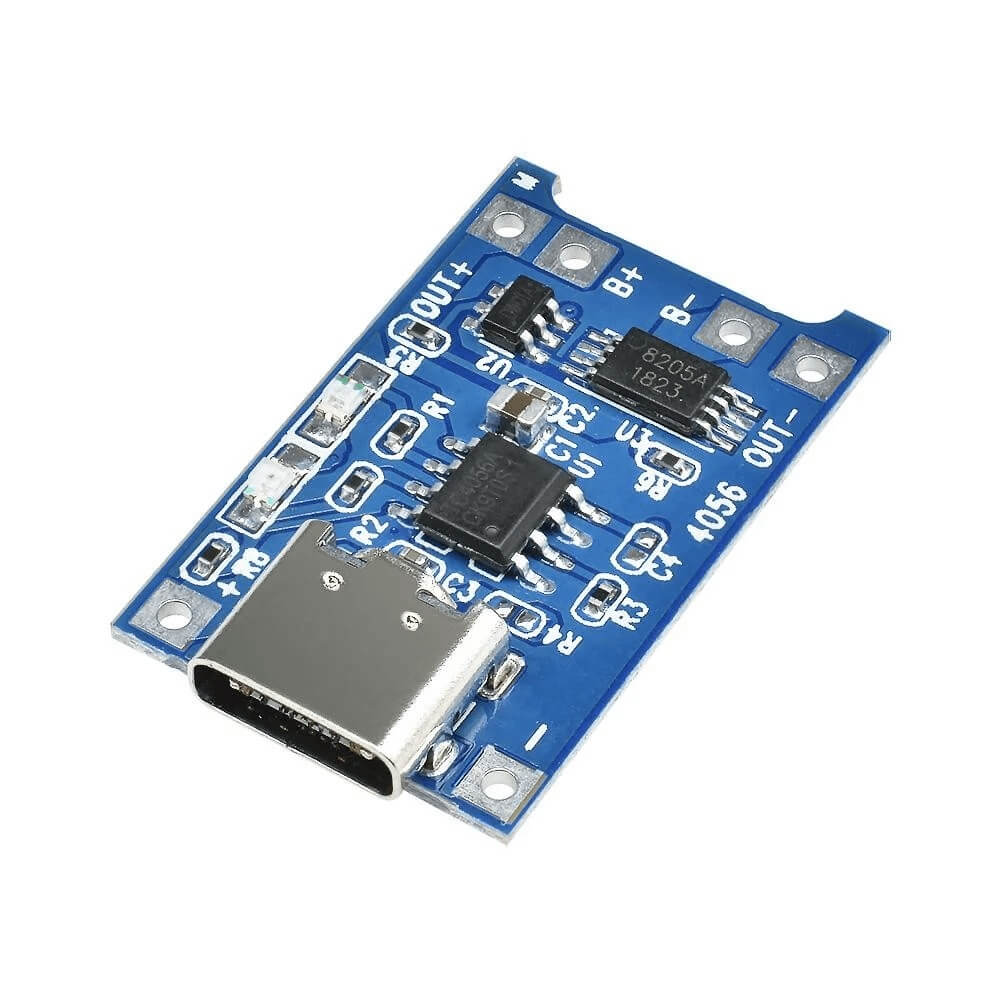
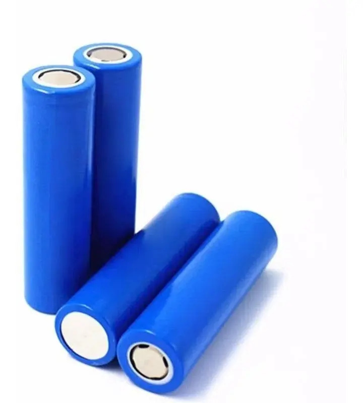

# Componentes Utilizados

Este documento apresenta os principais componentes utilizados no desenvolvimento do **Ultrasonic Insect Repeller**, descrevendo suas características e a função desempenhada por cada um no projeto.

---

# ESP32


## Descrição

O ESP32 é um microcontrolador desenvolvido pela Espressif Systems, amplamente utilizado em projetos de Internet das Coisas (IoT) e sistemas embarcados. Possui um processador dual-core, conectividade Wi-Fi e Bluetooth integradas e diversos periféricos de hardware, incluindo temporizadores, conversores analógico-digitais (ADC) e módulos de PWM.

## Função no projeto

O ESP32 é o componente responsável pelo controle de todo o sistema. Seu firmware realiza:

* Inicialização dos periféricos;
* Geração do sinal PWM em frequências ultrassônicas;
* Controle do tempo de emissão;
* Gerenciamento do funcionamento do dispositivo.

Sua capacidade de gerar sinais PWM com precisão torna o ESP32 adequado para aplicações envolvendo emissão de ultrassom.

---

# Transdutor Piezoelétrico



## Descrição

O transdutor piezoelétrico é um dispositivo capaz de converter energia elétrica em vibrações mecânicas através do efeito piezoelétrico. Quando excitado por um sinal elétrico alternado, produz ondas sonoras cuja frequência depende do sinal aplicado.

## Função no projeto

Neste projeto, o piezoelétrico é responsável por emitir as ondas ultrassônicas geradas pelo ESP32.

O sinal PWM produzido pelo microcontrolador é aplicado diretamente ao transdutor, que converte o sinal elétrico em ondas mecânicas na faixa de frequências definida pelo firmware.

---

# Módulo TP4056



## Descrição

O TP4056 é um módulo dedicado ao carregamento de baterias de íons de lítio (Li-ion) e polímero de lítio (Li-Po). Ele realiza o controle automático da corrente e da tensão durante o carregamento, proporcionando maior segurança e aumentando a vida útil da bateria.

## Função no projeto

O módulo TP4056 permite o carregamento da bateria utilizada para alimentar o dispositivo, dispensando a necessidade de removê-la para recarga.

Além disso, oferece proteção contra sobrecarga durante o processo de carregamento (dependendo da versão utilizada).

---

# Bateria Li-ion 18650



## Descrição

A bateria do tipo 18650 é uma célula recarregável de íons de lítio amplamente empregada em dispositivos eletrônicos portáteis devido à sua elevada densidade energética e longa vida útil.

## Função no projeto

É a principal fonte de alimentação do sistema, fornecendo energia ao ESP32 e aos demais componentes eletrônicos.

Sua utilização permite que o dispositivo opere de forma portátil, sem necessidade de alimentação externa durante o funcionamento.

---

# Chave Liga/Desliga


## Descrição

A chave liga/desliga é um interruptor mecânico utilizado para controlar manualmente a alimentação elétrica do circuito.

## Função no projeto

Permite ao usuário ligar ou desligar completamente o dispositivo, evitando consumo de energia quando o equipamento não estiver em uso.

---

# Visão Geral do Sistema

A interação entre os componentes pode ser representada pelo diagrama abaixo:

```text
Bateria Li-ion
       │
       ▼
    TP4056
       │
       ▼
Liga/Desliga
       │
       ▼
     ESP32
       │
PWM (20–40 kHz)
       │
       ▼
Piezoelétrico
```

Cada componente foi selecionado por desempenhar uma função específica dentro do sistema, contribuindo para a construção de um dispositivo compacto, portátil e dedicado ao estudo da geração de sinais ultrassônicos utilizando um microcontrolador ESP32.
